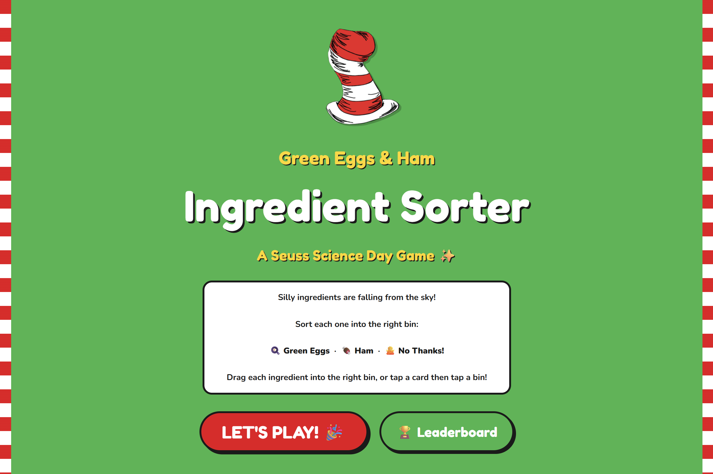
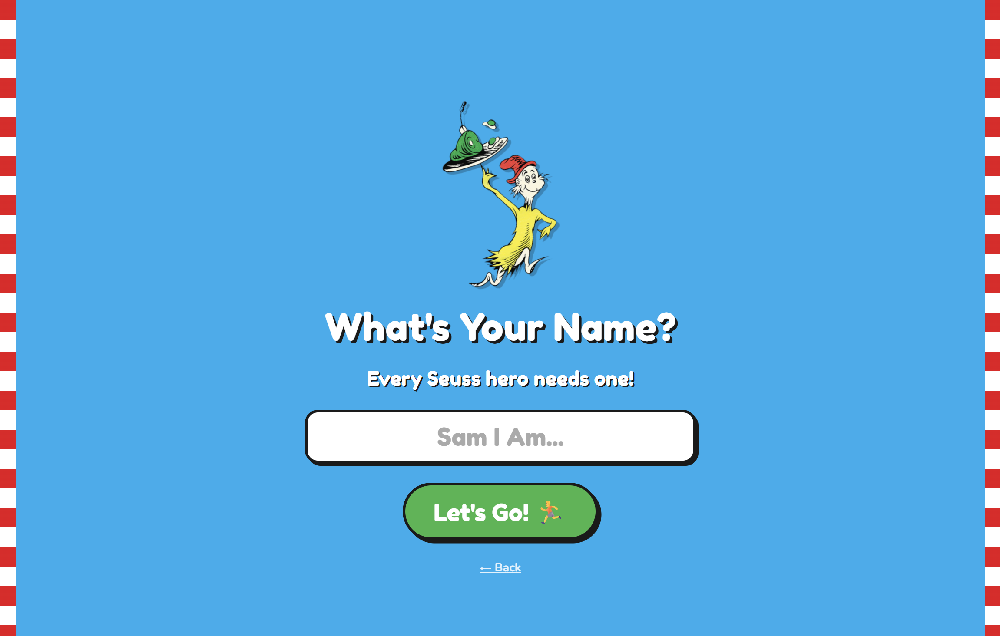
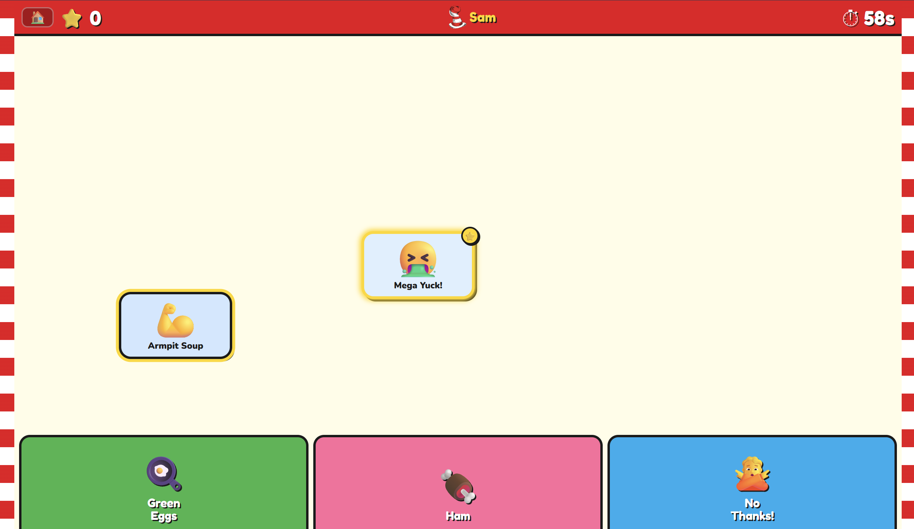
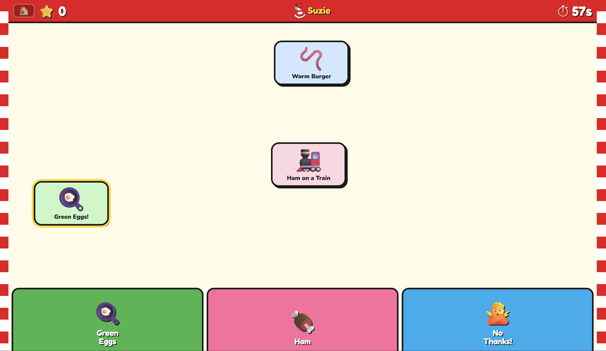
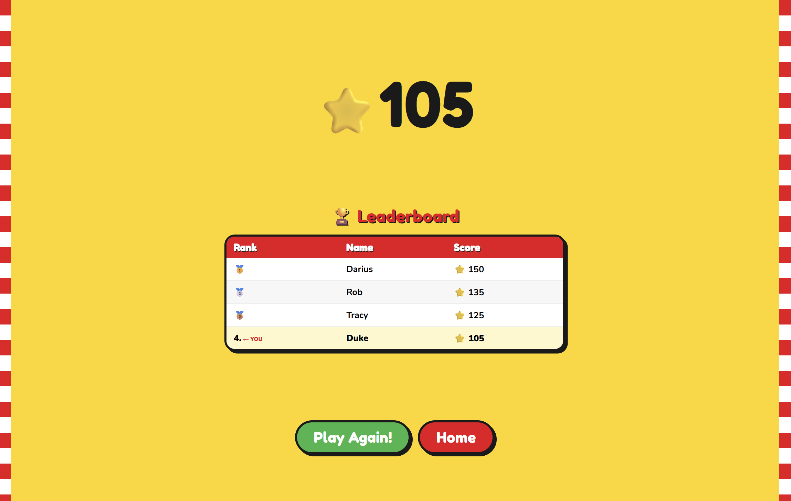
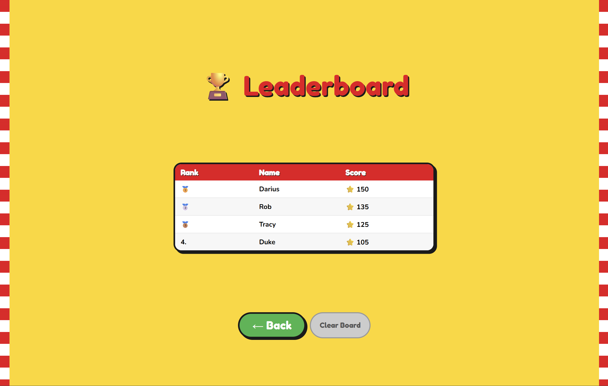

# Seuss Ingredient Sorter

A kiosk-style drag-and-drop game built for **Seuss Science Day** at [Code Ninjas Nixa](https://www.codeninjas.com/nixa-mo) — part of the [Launchpad Learning](https://launchpadlearning.io) program.

Players race against the clock to sort Dr. Seuss ingredients into the correct category. The game tracks high scores on a local leaderboard and runs entirely in the browser — no server, no dependencies, no internet required.

---

<p align="center">
  
  
</p>
<p align="center">
  
  
</p>
<p align="center">
  
  
</p>

---

## How to Play

1. Enter your name on the start screen
2. Ingredient cards fall from the top of the screen
3. Drag each card to the correct bin — **Green Eggs**, **Ham**, or **No Thanks!**
4. Score as many points as you can before the 60-second timer runs out
5. Watch the leaderboard to see if you made the top 10

---

## Scoring

| Action | Points |
|---|---|
| Correct sort | **+10** |
| Correct sort (⭐ Bonus card) | **+25** |
| Wrong sort | **−5** |

### Bonus Cards ⭐

Every game has a chance to spawn **bonus ingredient cards** — identifiable by their gold glowing border and ⭐ badge. They fall significantly faster than normal cards, so you have to be quick. Sorting one correctly awards **+25 points**, making them the key to separating top scores on the leaderboard.

---

## Game Features

### Physics & Cards
- Up to **5 ingredient cards** fall simultaneously
- Cards have randomized fall speeds for variety
- Cards **shake** when they pile up at the floor — a visual nudge to sort faster
- **Drag and drop** on touch or mouse; **keyboard controls** (arrow keys + Enter) also work

### Bonus Items
- ~20% of spawns are **bonus cards** — gold glow, ⭐ badge, faster fall speed
- Worth **+25** on a correct sort vs. +10 for regular cards
- Miss them or misdrop them and the point gap closes fast

### Sound Effects
- All sounds are **procedurally generated** with the Web Audio API — no audio files needed
- Distinct tones for: correct sort, wrong sort, card spawn, and a ticking countdown in the final 10 seconds
- Victory fanfare on game end

### Leaderboard
- Top 10 scores **persist across sessions** via `localStorage`
- A record-breaking banner animation fires when you beat the current high score
- **Admin-only PIN pad** to clear the board — the PIN is stored as a SHA-256 hash, not plaintext

### Kiosk-Ready
- Designed for **fullscreen touchscreen** use at events
- Works completely **offline** — just open `src/index.html` in Chrome
- No install, no build step, no internet connection required

---

## Running the Game

```bash
git clone https://github.com/Launchpad-Learning/seuss-ingredient-sorter.git
cd seuss-ingredient-sorter
# Open src/index.html in Chrome
```

---

## Built With

| Technology | What it does |
|---|---|
| Vanilla HTML / CSS / JS | The entire game — one self-contained file, no framework |
| CSS Flexbox | All screen layouts and card alignment |
| CSS Custom Properties | Theming (Seuss color palette) across every screen |
| CSS Animations & Keyframes | Card shake, glow pulse, pop-correct, pop-wrong, score floatUp |
| Web Audio API | Procedural sound effects — no external audio files |
| Web Crypto API (`crypto.subtle`) | SHA-256 hashing for the admin PIN |
| `localStorage` | Persistent leaderboard across browser sessions |
| `requestAnimationFrame` | Physics loop for smooth card falling |
| Pointer Events API | Unified drag-and-drop for both touch and mouse |

---

## Project Structure

```
seuss-ingredient-sorter/
├── src/
│   ├── index.html        # The entire game — one self-contained file
│   └── images/           # Game artwork (Dr. Seuss–themed PNGs)
└── images/               # README screenshots and gameplay GIF
```

---

## About

This game was created by the team at **[Code Ninjas Nixa](https://www.codeninjas.com/nixa-mo)** as part of the **Launchpad Learning** initiative — building real, shipped projects and showcasing what's possible with just the fundamentals of web development.

> "You have brains in your head. You have feet in your shoes." — Dr. Seuss

---

*Made with ❤️ and green eggs at Code Ninjas Nixa*
