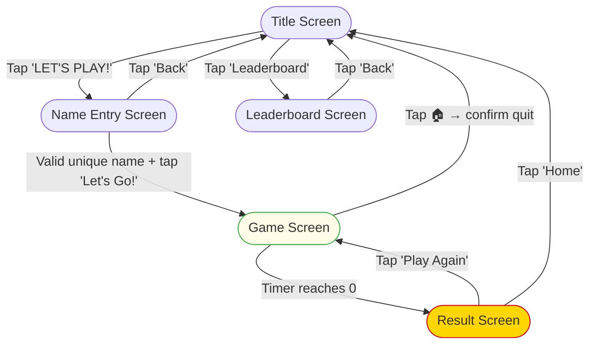

# Green Eggs & Ham — Ingredient Sorter
**Claude Code context file. Read this first in every session.**

---

## Project Identity

A touch-screen kiosk game built for the **Code Ninjas Nixa** booth at
**Seuss Science Day** (hosted by Ozarks Public Television), March 7 at Pat Jones YMCA.
Themed after Dr. Seuss's *Green Eggs and Ham*. Target audience: young children at a
family event. Expected usage: rapid back-to-back plays by different kids all day.

---

## Hard Constraints (govern every decision)

| Constraint | Detail |
|---|---|
| **Single HTML file** | All HTML, CSS, and JS live in `index.html`. No build tools, no npm, no bundler. |
| **No server needed** | Opened directly as a file in Chrome (`file://`). |
| **Primary input: touch** | Pointer Events API for drag-and-drop. Keyboard support (arrow keys + Enter) also works. |
| **No external runtime deps** | Google Fonts CDN is the only external call (gracefully degrades). |
| **Kiosk context** | Must reset cleanly between players. No persistent login. Name uniqueness enforced via localStorage. |
| **Images are relative** | `images/*.png` must stay next to `index.html` inside `src/`. |

---

## File Structure

```
seuss-ingredient-sorter/
├── src/
│   ├── index.html              ← The entire application
│   ├── CLAUDE.md               ← This file
│   └── images/
│       ├── cat-in-the-hat-hat.png    ← Title screen, HUD, result screen
│       └── green_eggs_ham.png        ← Name entry screen (Sam-I-Am)
├── images/                     ← README screenshots (not used by the game)
└── README.md
```

---

## Screen Flow



**Key behaviors:**
- **Name entry**: name must be unique in localStorage leaderboard. Same player can "Play Again" without re-entering name (skips name check).
- **Quit overlay**: pauses timer + spawning; "Keep Playing" resumes both.
- **Result screen**: saves score to leaderboard, shows full leaderboard with player's row highlighted. New #1 triggers a banner + sound.

---

## Code Map — `index.html` Sections

The file is organized with clear `/* ═══ SECTION ═══ */` comment banners. Use Grep to jump to them.

| Section | What it contains |
|---|---|
| `<style>` block | All CSS. CSS variables at `:root`. Sections match screen names. |
| `SOUND SYSTEM` | Web Audio API. `snd.correct()`, `snd.wrong()`, `snd.spawn()`, `snd.tick()`, `snd.start()`, `snd.gameOver()`, `snd.newRecord()`, `snd.select()`, `snd.cardSelect()` |
| `LEADERBOARD` | localStorage CRUD. Key functions: `lbGet()`, `lbSave()`, `lbIsNameTaken()`, `lbAddOrUpdate()`, `lbClear()`, `lbRenderRows()` |
| `INGREDIENT DATA` | `const INGREDIENTS` array (regular items) and `const BONUS_INGREDIENTS` array (fast, high-value items) |
| `STATE` | Single `state` object — source of truth for all runtime data |
| `DOM` | `const $` shorthand + cached DOM refs |
| `SCREEN MANAGEMENT` | `showScreen(name)` — shows one screen, hides all others |
| `NAME ENTRY` | `openNameEntry()`, `submitName()` |
| `GAME LIFECYCLE` | `startGame()`, `endGame()` |
| `CARD SPAWNING` | `spawnCard()` — 80% regular, 20% bonus |
| `PHYSICS LOOP` | `physicsLoop()` — rAF loop, moves cards downward, fades out missed cards at the floor |
| `SORT LOGIC` | `sortCard(card, binId)`, `getSelectedCard()`, `updateCardSelection()` |
| `DRAG / TOUCH` | `onCardPointerDown()` — drag-to-bin and tap-to-select |
| `NAME INPUT` | Enter key handler for on-screen keyboard |
| `BIN TOUCH / CLICK` | `pointerdown` on bin elements → sort selected card |
| `BUTTON WIRING` | All event listeners for buttons (quit overlay, nav buttons, etc.) |
| `PIN MODAL` | Admin PIN pad for clearing leaderboard. PIN stored as SHA-256 hash via Web Crypto API. |
| `INIT` | `showScreen('title')` |

---

## State Object

```js
let state = {
  screen: 'title',       // 'title' | 'name' | 'game' | 'result' | 'leaderboard'
  playerName: '',        // set at name entry; cleared on home/quit
  score: 0,
  timeLeft: 60,          // seconds remaining
  timerInterval: null,   // setInterval handle — always clear before reassigning
  spawnInterval: null,   // setInterval handle
  activeCards: [],       // [{ el, ingredient, x, y, velY, id, answered, dragging, atFloor }]
  nextId: 0,             // auto-increment for card IDs
  selectedCardIdx: 0,    // index into activeCards.filter(!answered) for tap-then-tap flow
  physicsRaf: null,      // requestAnimationFrame handle
  dragCard: null,        // { card, startClientX, startClientY, cardStartX, cardStartY } | null
};
```

**Important:** Always `clearInterval` timer/spawn handles before reassigning (done in `startGame()` and the quit overlay's "keep playing" handler).

---

## Gameplay Mechanics

### Scoring
| Action | Points |
|---|---|
| Correct sort (regular) | +10 |
| Correct sort (bonus) | +25 |
| Wrong sort | -5 |
| Missed (falls off screen) | 0 |

### Bonus Cards
- ~20% of spawns come from `BONUS_INGREDIENTS`
- Fall faster than regular cards (velY 5.6–7.6 vs 3.0–5.0)
- Visually distinct: gold pulsing glow border + ⭐ badge
- Worth +25 on correct sort
- Each ingredient has a `bonus: true` flag

### Missed Cards
- Cards that reach the floor fade out (`.missed` class, 0.5s animation) and are removed
- No point penalty for missed cards

---

## CSS Design System

### Variables (defined on `:root`)
```css
--red:      #E8001C   /* primary CTA, HUD bar, error states */
--green:    #3DB54A   /* title screen bg, green eggs bin, secondary buttons */
--yellow:   #FFD600   /* result screen bg, HUD player name, score popups */
--white:    #FFFFFF
--black:    #1A1A1A   /* all outlines and text shadows */
--cream:    #FFFDE7   /* game screen bg */
--pink:     #FF6B9D   /* ham bin */
--blue:     #00AEEF   /* no thanks bin, name entry screen bg */
--stripe-w: 24px      /* width of the red/white candy-stripe side borders */
```

### Key Classes
| Class | Purpose |
|---|---|
| `.screen` | All 5 screens share this. `position:absolute; inset:0`. Add `.hidden` to hide. |
| `.btn-primary` | Red button (main CTAs) |
| `.btn-secondary` | Green button (secondary actions) |
| `.btn-danger` | Gray→red hover (destructive actions like "Clear Board") |
| `.hat-img` | Hat image on title/result screens — `rotate(-11deg)` + drop-shadow |
| `.hud-hat` | Smaller hat image in game HUD |
| `.ingredient-card` | Falling card. Modifiers: `.selected`, `.dragging`, `.shake`, `.pop-correct`, `.pop-wrong`, `.missed` |
| `.ingredient-card.bonus` | Gold glow border (`bonusGlow` animation). Overrides for `.shake`, `.pop-correct`, `.pop-wrong` |
| `.bonus-badge` | Gold circle with ⭐ positioned top-right of bonus cards |
| `.bin` | Sorting target. Add `.flash-correct` or `.flash-wrong` on sort |
| `.lb-table tr.lb-you` | Highlights the current player's leaderboard row |
| `.quit-modal` | Seuss-styled quit confirmation card |
| `.pin-modal` | Admin PIN entry overlay (numpad + dot indicators) |

### Screen Background Colors & Layouts
- Title → `var(--green)`, `space-evenly`
- Name Entry → `var(--blue)`
- Game → `var(--cream)`
- Result → `var(--yellow)`, `scrollable`
- Leaderboard → `var(--yellow)`, `space-evenly` with `.lb-table-scroll { max-height: 55vh }`

---

## Common Patterns

### Adding a new screen
1. Add CSS block with `#screen-xyz { background: ...; gap: ...; }`
2. Add HTML `<div id="screen-xyz" class="screen hidden">...</div>`
3. Add key to `SCREENS` object in DOM section
4. Add `showScreen('xyz')` calls at appropriate nav points

### Adding a sound
Add a method to the `snd` object using `tone(freq, dur, type, vol, delay)`:
```js
snd.mySound() {
  tone(523, 0.08, 'square', 0.18);          // C5, 80ms
  tone(659, 0.08, 'square', 0.18, 0.09);   // E5, delayed 90ms
}
```

### Modifying ingredients
Edit `INGREDIENTS` (regular) or `BONUS_INGREDIENTS` (bonus) arrays:
```js
// Regular
{ name: "Display Name", emoji: "🦊", correct: "eggs"|"ham"|"nope", color: "#hex" }

// Bonus
{ name: "Display Name", emoji: "✨", correct: "eggs"|"ham"|"nope", color: "#hex", bonus: true }
```
Colors: green eggs `#c8f7c5`, ham `#ffd6e0`, no thanks `#d0e8ff`
Bonus colors: eggs `#fffacd`, ham `#ffe8f5`, nope `#ddf0ff`

### Leaderboard localStorage
- Key: `'geah_leaderboard_v1'`
- Format: `[{ name: string, score: number, date: string }]` sorted by score desc
- `lbAddOrUpdate(name, score)` returns `true` if new #1 high score

---

## Known Quirks / Decisions

- **`physicsLoop` never clears itself** — it checks `state.screen !== 'game'` and returns early. This is intentional; a new `rAF` is started in `startGame()`.
- **Quit overlay pauses by clearing intervals** — "Keep Playing" reinstates them. Slight timer drift (~1s) is acceptable for a kids' game.
- **`lbIsNameTaken` is case-insensitive** — `"Sam"` and `"sam"` are treated as the same name.
- **Clear Board uses a PIN pad overlay** — PIN is stored as a SHA-256 hash (`ADMIN_HASH`), verified via `crypto.subtle.digest`. Never stored as plaintext.
- **Bin `pointerdown` sorts the currently *selected* card**, not the card dragged over the bin — dragging is handled separately in `onCardPointerDown`.
- **Missed cards fade out** — cards that reach the floor get `.missed` class (0.5s fade), are marked `answered`, then removed from DOM and `activeCards`.
